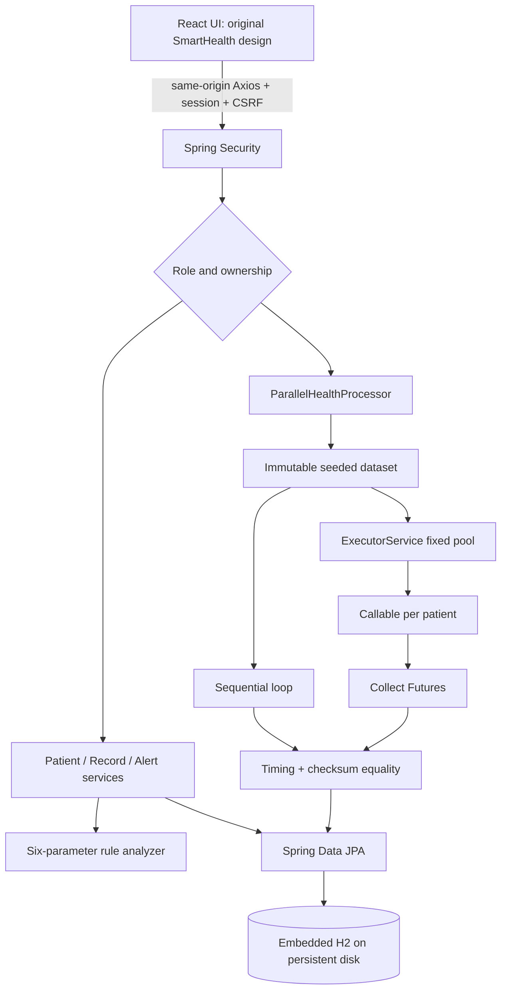
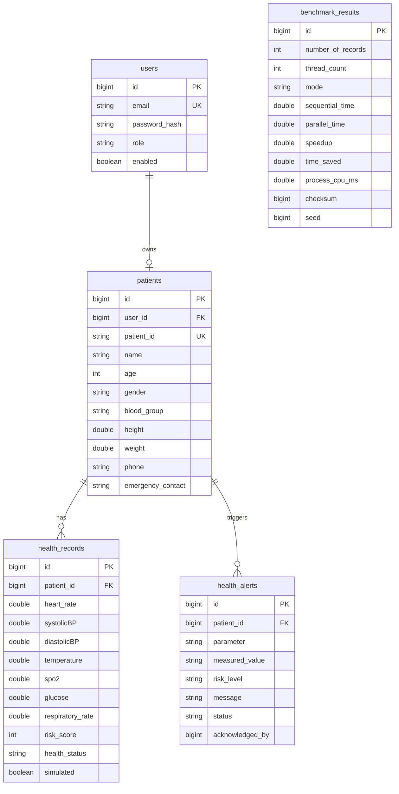

# Architecture

## Data model

Every table also has a UTC creation timestamp. Doctors are users with role `DOCTOR`; a redundant separate doctor table is unnecessary because no additional doctor-specific fields were requested. Staff-created patient profiles have no login owner; self-registered patients create their own linked profile. A unique user reference prevents a patient account from creating multiple profiles.
The care extension adds `care_profiles` (allergies, conditions, notes, updated-by), `medications` (instructions, source, status), and `appointments` (patient, doctor, requested time, lifecycle, version). All reference the patient through database foreign keys. Appointment confirmations lock the doctor and patient, reject overlapping confirmed 30-minute visits, and use version checks for stale updates. Embedded H2 is now the default and requires only a persistent directory and a single application instance.

Patient and health-record references are database foreign keys. Patient deletion removes dependent records and alerts in one transaction. Record creation and its alerts are also one transaction. Records and alerts are indexed for patient history; history endpoints return the latest 100 entries. Dashboard active-alert counts cover all records, not only the recent history window.

## Thread safety

Datasets are immutable lists of immutable records. Worker tasks do not mutate shared clinical data or use a persistence context. Each produces its own analysis and checksum. Collection occurs on the calling thread through Futures. Only the active-task counter is shared, using `AtomicInteger`. A semaphore bounds benchmark concurrency to one experiment per application instance.

Actual elapsed time includes scheduling overhead. Waiting for task completion does not fabricate speedup. Exceptions unwind through a `finally` block that stops the executor and waits for termination. Client errors are returned as structured responses; failed runs are not persisted as successful benchmarks.

## Security and deployment boundaries

Self-registration always assigns `PATIENT`, regardless of extra input fields. Staff endpoints enforce role authorization on the server. Patient access checks compare stored owner IDs with the authenticated account. Account disablement invalidates existing sessions on their next request. Password hashes are excluded from JSON.

The browser uses a session cookie (`HttpOnly`, `SameSite=Lax`) and a separate synchronizer CSRF token for mutations, including login/logout. Use HTTPS and `COOKIE_SECURE=true` when hosting publicly. The combined build serves both tiers from one origin; broad CORS is intentionally not enabled.

This bounded classroom system uses recent-history limits and automatic JPA schema updates. A production medical system would require a separate assessment of consent, auditing, retention, clinical validation, availability, and regulatory requirements. None is claimed here.
